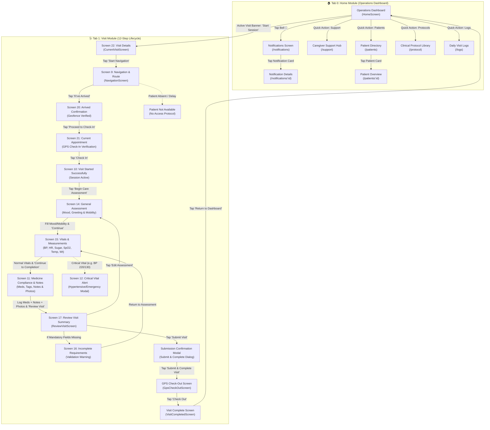

# Home & Visit Module Flow Documentation
**Caregiver Partner Application (Phase 11 v2)**

---

## 📌 Executive Summary

This document details the complete end-to-end user journeys, screen sequences, state transitions, and navigation mapping for:
1. **🏠 Home Module (Tab 0)** — Central Operations Dashboard & Service Hub.
2. **🩺 Visit Module (Tab 1)** — 12-Step Clinical Visit Execution Lifecycle & Exception Handling.

---

## 🗺️ Master Architecture & Navigation Diagram



---

# 🏠 Part 1: Home Module Flow (Tab 0)

The **Home Module** gives the caregiver instant situational awareness, quick shortcuts, active visit triggers, and daily schedule management.

```
                    ┌───────────────────────────────┐
                    │       HOME DASHBOARD          │
                    │   (Operations Dashboard)      │
                    └───────────────┬───────────────┘
                                    │
        ┌──────────────┬────────────┼─────────────┬──────────────┬─────────────┐
        ▼              ▼            ▼             ▼              ▼             ▼
  [Active Visit] [Notifications] [Support]    [Patients]    [Protocols]   [Daily Logs]
    Tap "Start"    Tap Bell 🔔    Help Desk    Directory     Clinical       Past Logs
        │              │            │             │            Guide           │
        ▼              ▼            ▼             ▼              ▼             ▼
   Visit Details  Notification  Call Support  Patient List  Protocol SOPs  Log Reports
    (Screen 22)     Details
```

### 1.1 Screen Breakdown & Features

#### 1. Operations Dashboard (`/home`)
* **Caregiver Profile Header**: Displays caregiver name ("Anita"), profile photo, shift status ("Active"), and sync status.
* **Active / Next Visit Banner**: Displays immediate scheduled patient ("Mrs. Sunita Patil, 78"), scheduled time (`10:30 AM`), address (`Kharadi, Pune`), care type (`Routine Wellness`), and primary CTA button **"Start Session"** / **"Resume Session"**.
* **Quick Action Hub (4-Grid)**:
  1. 📘 **Clinical Protocols** ➔ Routes to `/protocol`
  2. 📝 **Daily Logs** ➔ Routes to `/logs`
  3. 👥 **Patient Directory** ➔ Routes to `/patients`
  4. 🎧 **Support & Assistance** ➔ Routes to `/support`
* **Recent Activity Stream**: Timeline of completed morning visits, notifications, and logged vitals.
* **Upcoming Schedule**: Chronological list of upcoming visits for today with patient name, time slot, and address.

#### 2. Notifications & Alerts (`/notifications`)
* **Filter Tabs**: `All`, `Unread`, `Mandatory`.
* **Priority-Coded Cards**:
  * 🔴 **Critical Alerts**: Medication protocol modifications, vital threshold triggers.
  * 🔵 **Operational Updates**: Route reassignments, shift notifications.
  * ⚪ **System Alerts**: App updates, sync completion notices.
* **Next Action**: Tap any notification item ➔ Open **Notification Details (`/notifications/:id`)**.

#### 3. Notification Details (`/notifications/:id`)
* Displays full alert message (e.g. *"Medication Protocol Modification for Martha J. - Dosage adjusted from 10mg to 15mg"*).
* Metadata card linking to the patient and visit.
* Direct action buttons: **"View Active Visit"**, **"Mark as Acknowledged"**.

#### 4. Caregiver Support Hub (`/support`)
* **Immediate Assistance**:
  * 📞 **"Call Supervisor"** (Direct line to Clinical Care Coordinator).
  * 💬 **"Live Chat"** (24/7 in-app dispatch assistance).
* **Emergency Incident Reporting**: Log non-medical field safety issues.
* **IT Support Desk**: Create and track support tickets.
* **Operations Manual & FAQ**: SOPs for home entry, emergency protocols, hygiene guidelines.
* **Caregiver Wellness Card**: Access caregiver support and wellness resources.

#### 5. Patient Directory (`/patients`)
* **Search & Filter**: Real-time search bar + filter chips (`Risk Level: High/Medium/Low`, `Care Profile`, `Wing/Zone`).
* **Patient Cards**: Displays photo, full name, age, primary condition, room/address, and status badge.
* **Add Patient Action**: `+ Add Patient` floating/top button.
* **Next Action**: Tap any card ➔ Open **Patient Overview (`/patients/:id`)**.

#### 6. Clinical Protocol Library (`/protocol`)
* Categorized SOP reference cards:
  * 🔴 **Critical Action Protocols**: Cardiac arrest, sudden fall, acute hypotension.
  * 🔵 **Medication SOPs**: Insulin administration, high-risk medication verification.
  * 🟢 **Patient Care Guidelines**: Bed mobility, wound dressing, diabetic foot care.

#### 7. Daily Visit Logs (`/logs`)
* Filter logs by date range and status (`All`, `In-Progress`, `Completed`).
* Chronological cards showing past completed visits with duration, caregiver notes summary, and exportable PDF visit report link.

---

# 🩺 Part 2: Visit Module Flow (Tab 1)

The **Visit Module** enforces a compliant, 12-step sequential workflow for executing patient home care sessions.

```
Screen 22 (Visit Details)
   │  👉 Tap "Start Navigation"
   ▼
Screen 9 (Live Navigation & Route)
   │  👉 Tap "I've Arrived"
   ▼
Screen 20 (Arrived Confirmation)
   │  👉 Tap "Proceed to Check-In"
   ▼
Screen 21 (GPS Check-In Verification)
   │  👉 Tap "Check In"
   ▼
Screen 10 (Visit Started Successfully)
   │  👉 Tap "Begin Care Assessment"
   ▼
Screen 14 (Mood & General Wellbeing)
   │  👉 Tap "Continue"
   ▼
Screen 15 (Vitals: BP, Sugar, Heart Rate, SpO2)
   │  👉 Tap "Continue to Completion"
   ▼
Screen 11 (Medicine Compliance, Notes & Photos)
   │  👉 Tap "Review Visit"
   ▼
Screen 17 (Review All Visit Details)
   │  👉 Tap "Submit Visit"
   ▼
Submission Confirmation Popup
   │  👉 Tap "Submit & Complete Visit"
   ▼
GPS Check-Out Screen
   │  👉 Tap "Check Out"
   ▼
Visit Complete Screen
   │  👉 Tap "Return to Dashboard"
   ▼
🏠 Back to Home Dashboard
```

---

### 2.1 Detailed Step-by-Step Screen Walkthrough

| Step # | Screen Name / Screen ID | Screen Purpose & Key UI Components | Available User Actions & Next Transition |
| :---: | :--- | :--- | :--- |
| **1** | **Screen 22: Visit Details**<br>`/visits` | • Patient Header: Mrs. Sunita Patil, Age 78, ID #PT-8842, `Routine Wellness`<br>• Risk Tags: `[✱ Diabetes]` `[🏃 High Fall Risk]`<br>• Schedule: `10:30 AM - 11:30 AM`<br>• Address: `Kharadi, Pune`<br>• Recent Visit Summary quote with previous nurse name & date<br>• Quick Action Row: 📞 `Call Parent` \| 👥 `Call Family` \| 🪪 `View Profile` | • **Tap "Start Navigation"** ➔ Go to **Screen 9**<br>• Tap Quick Action Icons ➔ Initiate phone call or open patient details |
| **2** | **Screen 9: Live Route Navigation**<br>`/visits/navigate` | • Top HUD Card: **Travel Time (12 mins)** \| **Distance (2.3 km)** \| **Traffic (● Clear)**<br>• Live map with caregiver location ("You") and patient house pin ("Patient: Sarah J.")<br>• Bottom Sheet Card: Scheduled arrival window (09:30 AM - In 25 mins) | • **Tap "Open Google Maps"** ➔ Launches native external GPS<br>• **Tap "I've Arrived"** ➔ Go to **Screen 20**<br>• **Tap "Report Delay"** ➔ Opens delay notice dialog |
| **3** | **Screen 20: Arrival Confirmation**<br>`/visits/check-in` | • Progress Indicator: "Arrival Confirmed — Step 1 of 3"<br>• Map header with green badge `[✔ GPS: Verified Mumbai]`<br>• Title: *"You've Arrived - Confirmed at Mrs. Patil's Residence"*<br>• Metadata Grid: Arrival Time (`10:25 AM`) \| Status (`✔ Verified`)<br>• Notice Banner: Safety & sanitization protocol instructions | • **Tap "Proceed to Check-In ➔"** ➔ Go to **Screen 21**<br>• **Tap "Unable to Check-In"** ➔ Go to **Patient Not Available Screen** |
| **4** | **Screen 21: GPS Check-In Verification**<br>`/visits/check-in` | • Header: Current Appointment — 1224 Oakwood Ave (`10:30 AM — 11:30 AM`)<br>• Geofence Radar Map with `[🎯 GPS Accuracy: 5 meters | VERIFIED]`<br>• Patient Card: Arrival Time (`10:30 AM`) \| Patient Name (`Mrs. Gable`)<br>• 50-meter proximity verification notice box | • **Tap "➔ Check In"** ➔ Go to **Screen 10**<br>• **Tap "Unable to Check In"** ➔ Trigger manual check-in override |
| **5** | **Screen 10: Visit Started Successfully**<br>`/visits/started` | • Green check celebration badge with confetti background<br>• Status Title: *"Visit Started Successfully - Care session with Mrs. Eleanor Vance is now active"*<br>• Check-in confirmation summary: Check-In Time (`10:30 AM`), GPS (`Confirmed`), Status (`● In Progress`) | • **Tap "Begin Care Assessment ➔"** ➔ Go to **Screen 14**<br>• **Tap "View Visit Plan"** ➔ Expands care checklist |
| **6** | **Screen 14: Parent Details & General Assessment**<br>`/visits/assessment` | • Patient profile banner with risk tags<br>• **Greeting Completed** toggle switch (`ON / OFF`)<br>• **How is the patient feeling overall?**: 4 emoji selector cards (`Excellent`, `Good`, `Fair`, `Poor`)<br>• **Mood Observation**: Horizontal emoji row (`Happy`, `Calm`, `Neutral`, `Anxious`)<br>• **Mobility Status**: Selectable radio cards (`Walking Independently`, `Walking Stick`, `Wheelchair`, `Bedridden`)<br>• **Additional Observations**: Multi-line qualitative notes | • **Tap "Continue ➔"** ➔ Go to **Screen 15** |
| **7** | **Screen 15: Vitals & Measurements**<br>`/visits/assessment/blood-pressure` | • **Blood Pressure (Mandatory)**: Target field `120/80 mmHg` (highlights error if missing: *"Blood Pressure Required"*)<br>• **Heart Rate**: `72 bpm` ➔ `[IN RANGE]`<br>• **Blood Sugar**: `134 mg/dL` ➔ `[ELEVATED]`<br>• **SpO2**: `98 %` ➔ `[OPTIMAL]`<br>• **Temperature**: `98.4 °F` ➔ `[NORMAL]`<br>• **Weight**: `141.5 lbs` (`-0.5 LBS FROM BASELINE`)<br>• Clinical Observation notes + Auto-save indicator (`Saved ✔`) | • If all normal ➔ **Tap "Continue to Completion ➔"** ➔ Go to **Screen 11**<br>• If severe abnormal vital entered ➔ Triggers **Screen 12 (Critical Vital Alert)** |
| **8** | **Screen 11: Medicine Compliance & Visit Notes**<br>`/visits/assessment/completion` | • **Medicine Compliance Status Chips**: `[✔ Medicine Taken]`, `[🔄 Already Taken]`, `[✖ Missed]`, `[⊘ Refused]`, `[📦 Medicine Not Available]`<br>• **Visit Notes Quick Tag Chips**: `Patient Stable`, `Medicine Given`, `Needs Follow-up`, `Family Updated`, `Recommended Doctor Visit`<br>• **Clinical Notes Area**: Multi-line detailed notes editor<br>• **Visit Photos Gallery**: Photo capture button (`[📷 Capture Photo]`) + uploaded photo thumbnails | • **Tap "Review Visit ➔"** ➔ Go to **Screen 17** |
| **9** | **Screen 17 / 18: Review Visit Summary**<br>`/visits/review` | • Patient Summary Card (Mrs. Sunita Patil, Mumbai, Maharashtra)<br>• GPS signal warning/verified alert box<br>• **General Wellbeing Card**: Feeling & Mood summary<br>• **Health Assessment Grid**: 4-quadrant vital metrics (`BP 120/80`, `Sugar 110`, `Heart 72`, `SpO2 98%`)<br>• **Medicine Compliance Card**: `[✔ Taken - Morning dosage at 09:30 AM]`<br>• **Visit Notes Card**: Formatted notes preview<br>• **Visit Photos Gallery**: Thumbnails with `+ Add More` option | • **Tap "Submit Visit ➔"** ➔ If valid, opens **Submission Confirmation Modal**<br>• If missing mandatory items ➔ Opens **Screen 16**<br>• **Tap "✏ Edit Assessment"** ➔ Returns to Screen 14/15 |
| **10** | **Submission Confirmation Modal**<br>`/visits/submit/confirmation` | • Center-screen dialog with clipboard icon<br>• Title: *"Are you sure you want to complete this visit?"*<br>• Warning: *"Once submitted, the visit record cannot be edited without supervisor approval."*<br>• Summary pill: `Mrs. Sunita Patil — 1h 45m` | • **Tap "Submit & Complete Visit ➔"** ➔ Go to **GPS Check-Out Screen**<br>• **Tap "Back"** ➔ Closes dialog |
| **11** | **GPS Check-Out Screen**<br>`/visits/checkout` | • Patient details card with Home Care Visit ID #PT-4420-B<br>• Metrics: **Current Time (12:00 PM)** \| **Visit Duration (1.5h)**<br>• Map with GPS Verified geofence badge (`[✔ GPS Verified | Accuracy: 3m]`)<br>• Instructions: Confirm physical location on property for checkout | • **Tap "Check Out ⇥"** ➔ Go to **Visit Completed Screen**<br>• **Tap "Unable to Check Out"** ➔ Manual checkout review |
| **12** | **Visit Completed Screen**<br>`/visits/completed` | • Large green check circle badge<br>• Title: *"Visit Successfully Completed"*<br>• Summary Card: Patient name (`Mrs. Patil`), Duration (`1.5h`), Check-in (`10:30 AM`), Check-out (`12:00 PM`)<br>• **System Updates Checklist**: `[✔ Family Notified]` `[✔ Health Record Updated]` `[✔ Visit Report Generated]` `[✔ Dashboard Updated]` | • **Tap "Return to Dashboard"** ➔ Navigates back to **Tab 0 (Home Dashboard)**<br>• **Tap "View Visit Report"** ➔ Opens full finalized PDF/report |

---

# ⚠️ Part 3: Edge Cases & Exception Branches

### Branch A: Screen 12 — Critical Vital Alert Review (`/visits/critical-alert`)
* **Trigger**: Entered vital exceeds safety threshold (e.g. `BP: 220/130 mmHg` Hypertensive Crisis, `SpO2 < 90%`, or `Pulse > 140 bpm`).
* **UI Elements**:
  * Red full-bleed critical alert banner: *"Critical Blood Pressure - Hypertensive emergency detected. Immediate intervention required based on CareVault Pro safety protocols."*
  * Giant numeric displays for **Systolic (220)** and **Diastolic (130)**.
  * **Urgent Action Buttons**:
    1. 🚨 **"Call Ambulance (911)"** (Primary Red Button).
    2. 👥 **"Call Family"** (Secondary Outlined Button).
    3. 📝 **"Record Action Taken"** (Document clinical intervention).
  * Link: *"Continue Assessment >"* once emergency action is logged.

### Branch B: Screen 16 — Incomplete Submission Requirements
* **Trigger**: Caregiver attempts to tap "Submit Visit" on Screen 17 with missing required data.
* **UI Elements**:
  * Amber alert banner: *"Complete the following before submitting"*.
  * List of missing items with direct action chips:
    * ⚠️ `Blood Pressure Required` ➔ Tap to open BP entry.
    * ⚠️ `Medicine Compliance not selected` ➔ Tap to mark medicine.
    * ⚠️ `Visit Notes missing` ➔ Tap to enter notes.
  * **Buttons**:
    * **"Return to Assessment"** ➔ Jumps directly to missing field.
    * **"Save Draft and Exit"** ➔ Saves state to local SQLite database.

### Branch C: Patient Not Available Screen (`/visits/patient-not-available`)
* **Trigger**: Caregiver arrives at the residence but the patient does not answer the door or is unavailable.
* **UI Elements**:
  * Status badge: `[UNSUCCESSFUL VISIT]`.
  * Title: *"Patient did not answer the door"*.
  * Immediate protocol steps:
    1. 📞 **"Call Parent"** (Direct line).
    2. 👥 **"Call Family"** (Primary contact: Sarah Smith).
    3. ⏳ **"Wait 10 Minutes"** (Countdown timer before declaring no-access).
  * Mandatory reason dropdown (`No Access - Door Locked`, `Patient Hospitalized`, `Family Refused Visit`).
  * Additional observations input box.
  * **Action**: **"Submit Report"** ➔ Returns to Dashboard with flagged status.

---

# 🔗 Part 4: Technical Router & Riverpod State Mapping

### Router Table (`lib/core/router/app_router.dart`)

| Route Constant | Path | Screen Widget | Description |
| :--- | :--- | :--- | :--- |
| `AppRoutes.home` | `/home` | `HomeScreen` | Tab 0 - Operations Dashboard |
| `AppRoutes.notifications` | `/notifications` | `NotificationsScreen` | Pushed notification center |
| `AppRoutes.notificationDetail` | `/notifications/:id` | `NotificationDetailsScreen` | Pushed notification reader |
| `AppRoutes.patients` | `/patients` | `PatientDirectoryScreen` | Patient list & filters |
| `AppRoutes.patientDetail` | `/patients/:id` | `PatientOverviewScreen` | Detailed patient history |
| `AppRoutes.logs` | `/logs` | `DailyVisitLogsScreen` | Completed daily visit logs |
| `AppRoutes.protocol` | `/protocol` | `ClinicalProtocolLibraryScreen` | SOP clinical library |
| `AppRoutes.support` | `/support` | `CaregiverSupportHubScreen` | Caregiver helpline & tickets |
| `AppRoutes.visits` | `/visits` | `CurrentVisitScreen` | Tab 1 - Screen 22 Visit Details |
| `AppRoutes.visitNavigate` | `/visits/navigate` | `NavigationScreen` | Screen 9 - GPS live route |
| `AppRoutes.visitCheckIn` | `/visits/check-in` | `CheckInScreen` | Screen 20 / Screen 21 Check-In |
| `AppRoutes.visitAssessment` | `/visits/assessment` | `CareAssessmentScreen` | Screen 14 - Mood & Mobility |
| `AppRoutes.visitBloodPressure` | `/visits/assessment/blood-pressure` | `BloodPressureDetailsScreen` | Screen 15 - Vitals capture |
| `AppRoutes.visitAssessmentCompletion` | `/visits/assessment/completion` | `AssessmentCompletionScreen` | Screen 11 - Meds & Notes |
| `AppRoutes.visitReview` | `/visits/review` | `ReviewVisitScreen` | Screen 17 - Review Visit |
| `AppRoutes.visitSubmitConfirmation` | `/visits/submit/confirmation` | `SubmissionConfirmationScreen`| Modal - Confirmation |
| `AppRoutes.visitCheckout` | `/visits/checkout` | `GpsCheckOutScreen` | Screen - GPS Check-Out |
| `AppRoutes.visitCompleted` | `/visits/completed` | `VisitCompletedScreen` | Screen - Final Success Card |
| `AppRoutes.visitCriticalAlert` | `/visits/critical-alert` | `CriticalVitalAlertReviewScreen`| Exception - Critical vital alert |
| `AppRoutes.visitPatientNotAvailable` | `/visits/patient-not-available` | `PatientNotAvailableScreen` | Exception - Patient no-show |

### State Providers (`lib/features/visit_workflow/presentation/providers/`)
* **`activeVisitProvider`**: Holds the current visit model, session stage enum (`idle`, `navigating`, `arrived`, `checkedIn`, `inAssessment`, `reviewing`, `checkedOut`, `completed`), check-in timestamp, and check-out timestamp.
* **`assessmentProvider`**: State notifier containing:
  * `greetingCompleted: bool`
  * `patientFeeling: PatientFeeling?` (`excellent`, `good`, `fair`, `poor`)
  * `mood: MoodType?` (`happy`, `calm`, `neutral`, `anxious`)
  * `mobility: MobilityStatus?` (`independent`, `stick`, `wheelchair`, `bedridden`)
  * `vitals: VitalsModel` (`bloodPressure`, `heartRate`, `bloodSugar`, `spo2`, `temperature`, `weight`)
  * `medicineCompliance: MedicineStatus?` (`taken`, `alreadyTaken`, `missed`, `refused`, `unavailable`)
  * `clinicalNotes: String`
  * `visitPhotos: List<String>` (local image paths)
